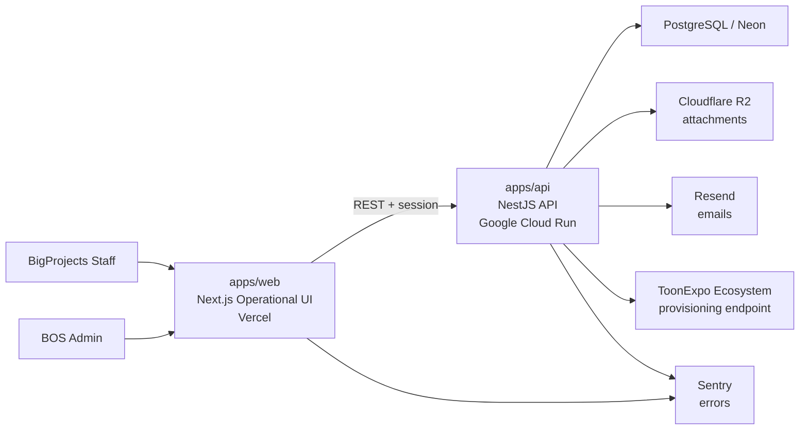
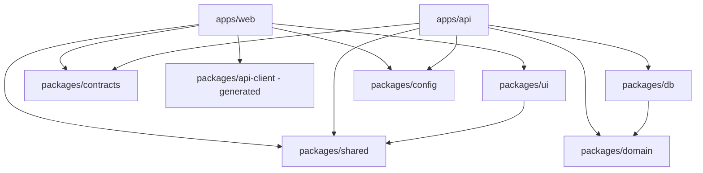
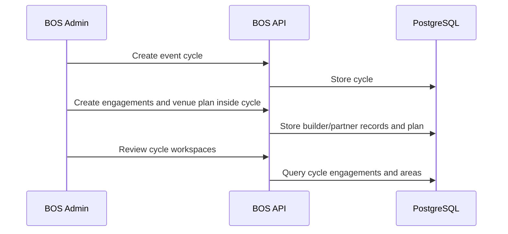
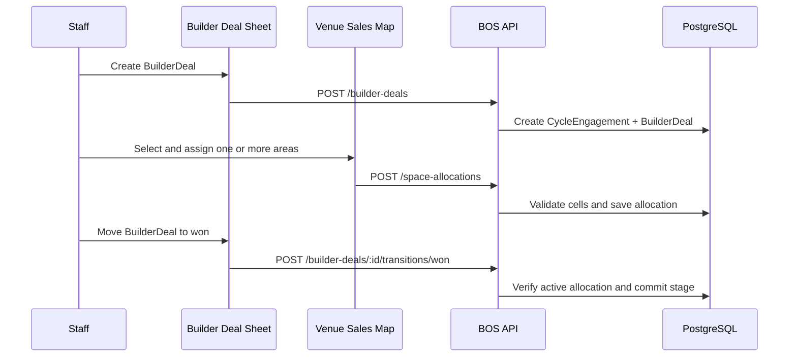
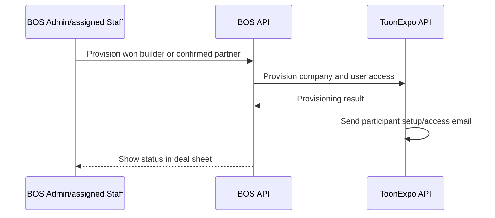
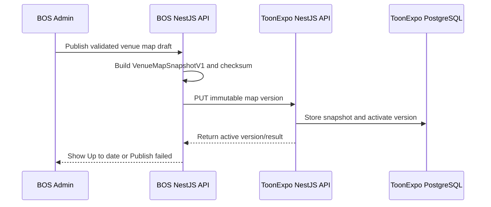

# BigProjects BOS - Technical Architecture

Internal business operating system for BigProjects. Release 1 manages event cycles, builder sales, partner relations, venue-space sales and ToonExpo provisioning/public-map publication.

**Project size:** C - large  
**Architecture style:** modular monolith in a monorepo  
**Primary deployables:** `apps/web` and `apps/api`  
**Last updated:** 2026-07-20

---

## 1. Architecture Thesis

BigProjects BOS is not a public website and not the ToonExpo participant platform. It is an internal operational system where the team organizes each ToonExpo cycle from the first lead to approved participation and account provisioning.

The correct architecture is a **modular monolith**:

- one product repository;
- one Next.js operational web app;
- one NestJS API deployed as a container to Google Cloud Run;
- shared packages for domain logic, contracts, database, UI and tooling;
- strict module boundaries so Builder Sales, Partner Relations, Venue Sales Map and integrations do not become one tangled codebase.

This gives the team enough structure for a large product without the cost and confusion of microservices.

BOS is a full production product, not an MVP or prototype. The implementation may be delivered incrementally, but the architecture, security, migrations, observability and acceptance criteria must be production-ready from the first release.

### Authoritative runtime boundary

```text
Browser -> Next.js frontend -> NestJS REST API -> Prisma -> PostgreSQL
```

`apps/web` is never a second backend. It must not contain product API routes, product mutations in Server Actions, Prisma imports, direct database access or authoritative business rules. All backend behavior belongs to `apps/api`. See [Frontend / Backend Boundary](./architecture/FRONTEND_BACKEND_BOUNDARY.md).

---

## 2. System Context



### Boundary

BOS owns internal operational work. ToonExpo owns public/builder/buyer platform work.

BOS sends only the minimum required provisioning request to ToonExpo when a participant is approved. BOS does not mirror ToonExpo inventory, buyer, QR or CRM data.

---

## 3. Runtime Components

| Component | Path | Responsibility | Deployment |
|---|---|---|---|
| Web app | `apps/web` | Internal cycle, CRM, partner, venue-map, provisioning and settings UI | Vercel |
| API app | `apps/api` | Business logic, RBAC, validation, persistence, provisioning integration | Google Cloud Run |
| Domain package | `packages/domain` | Small shared kernel for cross-module value objects only | bundled into API |
| Contracts package | `packages/contracts` | Framework-neutral shared enums/constants only | bundled |
| Generated API client | `packages/api-client` | Hey API fetch SDK, TypeScript models and Zod schemas generated from NestJS OpenAPI | bundled into web |
| Database package | `packages/db` | Prisma schema, migrations, database client, persistence mapping | bundled |
| UI package | `packages/ui` | Shared UI primitives: cards, sheets, tables, filters, forms | bundled |
| Shared package | `packages/shared` | Utilities, constants, logger interfaces, formatting helpers | bundled |
| Config package | `packages/config` | ESLint, TypeScript, Tailwind, Prettier and build config | bundled |

---

## 4. Monorepo Layout

```text
bigprojects-bos/
  apps/
    web/
      src/
        app/                  # Next.js App Router
        features/             # feature UI by module
        components/           # app-level components
        lib/                  # browser/server generated-client adapters, UI auth state, config
      public/
    api/
      src/
        modules/              # NestJS product modules
        common/               # guards, decorators, filters, interceptors
        integrations/         # ToonExpo provisioning client
        main.ts
      Dockerfile              # Cloud Run container target
  packages/
    domain/                   # small shared kernel; feature domains stay in API modules
    contracts/                # framework-neutral enums/constants only
    api-client/               # openapi.json + generated src/generated; never hand-edited
    db/                       # Prisma schema/client/migrations; API runtime only
    ui/                       # reusable UI primitives
    shared/                   # utility helpers
    config/                   # shared tooling config
  docs/
  package.json
  pnpm-workspace.yaml
  turbo.json
```

The first implementation should create this skeleton before individual business modules are built.

---

## 5. Dependency Rules



Hard rules:

- `packages/domain` is a small shared kernel, not a global home for all business logic; it must not import Next.js, NestJS, Prisma, React or browser APIs.
- Feature-specific domain rules live in `apps/api/src/modules/<module>/domain`.
- `packages/db` maps database records to domain concepts; it does not own business policy.
- `packages/contracts` owns only framework-neutral shared enums/constants; it contains no HTTP validators or business rules.
- NestJS class-validator DTOs are the sole manually authored HTTP contract. OpenAPI generated from them is the input to `@hey-api/openapi-ts`.
- NestJS Swagger writes `packages/api-client/openapi.json`; Hey API consumes it into `packages/api-client/src/generated`. Both are committed generated artifacts, never hand-edited and imported by `apps/web` only; `apps/api` must not depend on the package. `apps/web/src/lib/api-client/` is the hand-written runtime boundary with separate browser mutation and server-only read adapters.
- `apps/web` never imports Prisma or server secrets.
- `apps/web` does not import `packages/domain`; it consumes API contracts and view models.
- `apps/api` is the only runtime that talks directly to the database and backend external services.
- Product endpoints must not be implemented in Next.js route handlers.
- Product mutations must not be implemented as Next.js Server Actions.
- Cross-module imports go through public module exports, not deep internal paths.

---

## 6. Domain Modules

| Module | Owner | Core responsibility |
|---|---|---|
| Event Cycles | BOS | Cycle containers such as `ToonExpo 2026-Q1` for every engagement and venue plan |
| Organizations & Contacts | BOS | Stable identities reused across event cycles |
| Builder Sales | BOS | BuilderDeal board/list/sheet, commercial stages and `won` policy |
| Partner Relations | BOS | Separate PartnerParticipation board/list/sheet and shorter lifecycle |
| Venue Sales Map | BOS | Metric plan, cells, areas, allocations and publication state |
| ToonExpo Provisioning | BOS -> ToonExpo | Idempotent builder/partner company and user provisioning |
| Public Map Publication | BOS -> ToonExpo | Versioned `VenueMapSnapshotV1` delivery |
| Notes / Attachments / Audit | BOS | Cross-cutting records attached to included business entities |

Dashboard, onboarding checklist, tasks/workspaces, KPI and full analytics/reports remain documented later modules and are not Release 1 dependencies.

---

## 7. Core Data Flows

### 7.1 Event Cycle Flow



### 7.2 Builder Sale And Space Flow



### 7.3 ToonExpo Provisioning Flow



Provisioning must be idempotent. Retrying the same engagement must not create duplicate ToonExpo companies or users.

### 7.4 Public Map Publication Flow



---

## 8. Frontend Architecture

BOS frontend is an operational workspace. It should be dense, fast and predictable.

### UI model

```text
workspace page -> card/row -> side sheet
linked entity   -> stacked sheet
short action    -> dialog or inline confirmation
```

Full pages are reserved for true workspaces:

- Event Cycles;
- Builder Sales board/list;
- Partner Relations board/list;
- Venue Sales Map editor;
- ToonExpo Provisioning;
- Settings.

Entity details open in side sheets. A builder deal, partner participation, organization, contact or map area should not force the user to leave the current workspace unless it is a full workflow.

### Frontend feature layout

```text
apps/web/src/features/
  cycles/
  organizations/
  builder-sales/
  partner-relations/
  venue-map/
  provisioning/
  settings/
```

Each feature should expose only its public UI and hooks. Shared primitives belong in `packages/ui`; business-specific screens stay in `apps/web/src/features`.

Frontend data rules:

- Server Components may fetch the NestJS API for initial rendering.
- Client Components may use the same typed API client through query/mutation hooks.
- Forms may validate locally for user feedback, but NestJS repeats authoritative validation.
- Route protection in Next.js improves navigation only; NestJS guards enforce real authorization.
- `app/api` and Server Actions are not product backend extension points.

---

## 9. Backend Architecture

The API is the complete backend and runs as a NestJS modular monolith. Each module owns its controllers, application services, domain policies, persistence adapters and permission checks.

```text
apps/api/src/modules/
  auth/
  users/
  cycles/
  organizations/
  contacts/
  cycle-engagements/
  builder-deals/
  partner-participations/
  venue-map/
  map-publications/
  provisioning/
  audit-log/
```

Recommended internal module shape:

```text
modules/deals/
  presentation/
    deals.controller.ts
    dto/
  application/
    commands/
    queries/
    deals.service.ts
  domain/
    deal.policy.ts
    deal.errors.ts
  infrastructure/
    prisma-deals.repository.ts
  deals.module.ts
```

API rules:

- REST endpoints grouped by module.
- OpenAPI/Swagger generated from controllers and DTOs.
- Global `ValidationPipe` validates class-validator DTOs at the boundary.
- Hey API deterministically generates frontend fetch functions, TypeScript models and Zod schemas from OpenAPI. The OpenAPI artifact and generated package are committed; CI regenerates them and rejects drift/manual edits.
- Generated Zod is a frontend UX aid only. Cross-field, authorization, database and business invariants stay in NestJS/PostgreSQL.
- RBAC and ownership checks before business mutations.
- Audit logs for important auth, status, allocation, attachment, provisioning and publication changes.
- No business workflow hidden in React components.
- No product controller, repository or integration orchestration in `apps/web`.
- Cross-module writes go through the owning module's application service.

---

## 10. Data Architecture

BOS data is cycle-centered.

Core entities:

| Entity | Purpose |
|---|---|
| User | Internal BOS user |
| StaffProfile | Staff metadata and responsibility |
| EventCycle | Operational container for each ToonExpo iteration |
| Organization | Long-lived neutral organization record |
| Contact | Person connected to an Organization |
| CycleEngagement | Shared per-cycle context with exactly one business subtype |
| BuilderDeal | Builder-only space sales record and stages |
| PartnerParticipation | Partner-only participation record and stages |
| VenuePlan | Calibrated map and publication state for a cycle |
| VenuePlanRevision | Immutable source/calibration lineage; one active authoring revision |
| VenuePlanCell | Classified 1 m x 1 m logical cell inside a revision |
| VenueLandmark | Public/private point or named zone inside a revision |
| SpaceArea | Named contiguous set of sellable cells |
| SpaceAllocation | Active or historical link from area to CycleEngagement |
| VenueMapPublication | Immutable publication attempt/version metadata |
| ProvisioningRequest | BOS -> ToonExpo account creation request |
| AuditLog | Immutable important event; projected into entity activity timelines |
| Attachment | File metadata attached to entities |

Database implementation:

- PostgreSQL 18.x on Neon;
- Prisma ORM 7.x schema, generated client and migrations stored in `packages/db`;
- runtime uses one container-scoped PrismaClient with `@prisma/adapter-pg` and the pooled DML-only `DATABASE_URL`;
- Prisma CLI/migrations load the direct owner `DIRECT_URL` through `prisma.config.ts`; handlers do not call `$disconnect()`;
- only `apps/api` imports the runtime Prisma client;
- migrations run once from CI/deployment tooling, not from Next.js or an API request;
- explicit archive/lifecycle fields for referenced business records; no generic soft-delete convention;
- timestamps and actor IDs on important mutations;
- indexes on cycle, engagement kind, business stage, assignee, Organization, area cells, active allocations, publication and provisioning status.

---

## 11. Integration Boundary With ToonExpo

BOS is the source of truth for internal participant acquisition, venue-map authoring, allocations and publication decisions.

ToonExpo is the source of truth for public platform accounts, projects, apartments, buyer QR, CRM leads and exhibition experience.

Required initial production integration:

```text
Won BuilderDeal or confirmed PartnerParticipation
  -> provisioning request
  -> ToonExpo creates company/user/module access
  -> ToonExpo returns status and external IDs
  -> BOS stores status on the deal/provisioning request
```

Second required Release 1 integration:

```text
BOS VenuePlan draft
  -> explicit Admin publish
  -> VenueMapSnapshotV1
  -> ToonExpo stores its own immutable public copy
  -> ToonExpo activates the version only after successful validation
```

Not part of the current production scope:

- syncing ToonExpo buyer data back to BOS;
- syncing builder apartment inventory to BOS;
- duplicating ToonExpo CRM inside BOS;
- event check-in reporting inside BOS unless a later reporting requirement appears.

---

## 12. Security Model

Security baseline:

- NestJS-owned authentication using Passport and the confirmed cookie/session strategy;
- httpOnly secure cookies;
- role checks: BOS Admin, BOS Staff, BOS Viewer;
- assignment policies for Staff mutations; all Release 1 operational records remain visible to Staff;
- input validation for every API mutation;
- rate limits on auth and provisioning endpoints;
- no secrets in frontend code;
- audit log for stages, area edits, allocations, publication and provisioning attempts.

R2 file access uses signed upload/download flows. Uploads remain quarantined until NestJS verifies size/type/checksum and a pinned ClamAV sidecar returns clean. Files are not a separate product module in v1; they are attachments on domain entities.

---

## 13. Deployment Architecture

| Environment | Web | API | Database | Purpose |
|---|---|---|---|---|
| Development | `localhost:3000` | `localhost:4000` | PostgreSQL 18 container | Local development; MinIO/ClamAV/Mailpit/ToonExpo stubs |
| Staging | Vercel preview/staging | Cloud Run `europe-west3` staging service | Neon AWS `eu-central-1` staging branch/db | Acceptance and QA |
| Production | Vercel production domain | Cloud Run `europe-west3` production service | Neon AWS `eu-central-1` production db | Live BOS |

Infrastructure:

- Vercel hosts `apps/web`;
- Google Cloud Run hosts `apps/api`;
- Cloud Scheduler triggers the same-image Cloud Run integration-dispatch Job every minute;
- Neon/PostgreSQL stores relational data;
- Cloudflare R2 stores attachments;
- Resend sends BOS invitation/password-reset emails; ToonExpo sends participant access email;
- Sentry tracks runtime errors;
- GitHub Actions runs lint, typecheck, tests and builds.

Cloud Run receives a Docker image built from `apps/api/Dockerfile`. Runtime configuration comes from validated environment variables and Google Secret Manager.

Cloud Run and Neon are both provisioned in Frankfurt to minimize the permanent API-to-database network hop. No RTT is promised in documentation: staging measures p50/p95 database latency before production promotion, and changing the pair requires recorded evidence and an architecture decision.

---

## 14. Scaling Strategy

Expected v1 load is operational, not high traffic. Optimize for correctness, clarity and fast iteration first.

Scale path:

1. Keep the modular monolith.
2. Add database indexes based on real slow queries.
3. Add Upstash Redis only when caching, queues or rate-limit storage become necessary.
4. Move heavy background work into a worker only when a real workload appears.
5. Keep integrations idempotent so retries are safe.

---

## 15. Key Decisions

| Decision | Choice | Reason |
|---|---|---|
| Product split | BOS separate from ToonExpo | Different users, lifecycle and ownership |
| Architecture | Modular monolith | Simpler than microservices, still structured |
| Repo layout | `apps/*` and `packages/*` | Fits Size C and two deployables |
| Frontend | Next.js App Router | Strong for operational web UI |
| Backend | NestJS | Modules, guards, validation and OpenAPI |
| API style | REST + OpenAPI | Clear CRUD/workflow contract |
| API client | Hey API generated fetch SDK + Zod | One authored backend contract and deterministic frontend artifacts |
| Database | PostgreSQL 18 + Prisma ORM 7 | Relational workflows and reporting |
| API hosting | Google Cloud Run | Containerized NestJS runtime |
| Web hosting | Vercel | Best fit for Next.js |
| Integration | Provisioning plus versioned public map snapshots | Supports required workflows without shared databases or broad synchronization |
| Map UI | Konva 10.x + react-konva 19.2.x | Interactive metric editor and reusable read-only rendering model |

---

## 16. Implementation Guardrails

- Do not create a separate Documents module in the current production scope; attach files to entities.
- Do not create broad ToonExpo sync in the current production scope.
- Do not merge BuilderDeal and PartnerParticipation into one generic Deal table.
- Do not persist Konva scene JSON as the business source of truth.
- Do not expose private allocation identity in the public map snapshot.
- Do not overbuild roles in the initial production release; start with Admin, Staff and Viewer.
- Do not place backend code, Prisma access or product API routes in Next.js.
- Do not add queues or realtime until a concrete workflow needs them.
- Every module must have docs, entity fields and acceptance criteria before deep implementation.

---

## 17. Related Documents

- [Tech Card](./TECH_CARD.md)
- [Production Scope](./00-Development-Start/01-Production-Scope.md)
- [Dependency Graph](./architecture/DEPENDENCY_GRAPH.md)
- [Frontend / Backend Boundary](./architecture/FRONTEND_BACKEND_BOUNDARY.md)
- [BOS / ToonExpo Boundary](./03-Integration-With-ToonExpo/01-BOS-ToonExpo-Boundary.md)
- [Integration Contracts](./03-Integration-With-ToonExpo/03-Integration-Contracts.md)
- [Decisions](./DECISIONS.md)
- [Authentication And Security](./00-Development-Start/07-Authentication-And-Security.md)
- [API Surface](./00-Development-Start/08-API-Surface.md)
- [Venue Map Entity Fields](./01-BigProjects-BOS/01-Modules/10-Venue-Sales-Map/09-Entity-Fields.md)
- [Implementation Readiness](./00-Development-Start/09-Implementation-Readiness.md)
- [Delivery And Operations](./00-Development-Start/10-Delivery-And-Operations.md)
